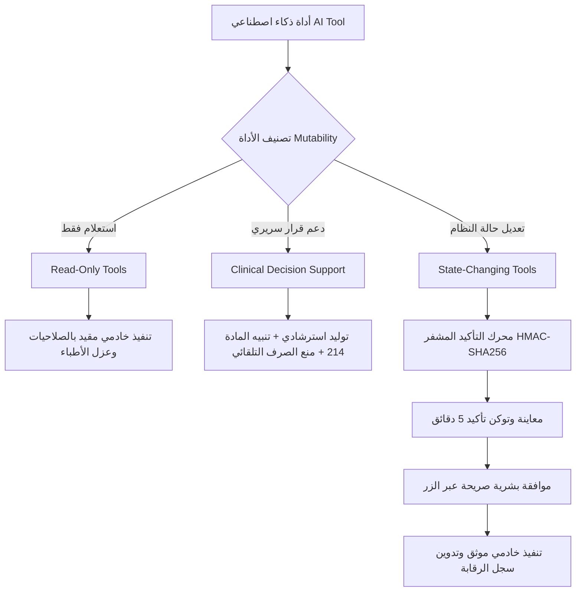

# النموذج الأمني للذكاء الاصطناعي (AI Security Model)
## مركز الدكتور عقلان الكامل لطب وجراحة وتقويم الأسنان
### مسار الحماية والجاهزية للإنتاج (P0 AI Security Hardening)

---

## 1. الفلسفة والمبادئ الأمنية الحاكمة (Guiding Principles)

1. **الذكاء الاصطناعي ليس مستخدماً مميزاً (AI is never more privileged than the user):**
   - لا يمتلك الذكاء الاصطناعي أي صلاحية أعلى من المستخدم البشري المسجل حالياً في الجلسة.
   - الذكاء الاصطناعي يمتثل لنفس القيود الصارمة المطبقة على شاشات النظام العادية.

2. **انعدام الثقة في مدخلات العميل والموديلات الخارجية (Zero-Trust Model):**
   - رسائل العميل (Client Messages) لا يمكنها ادعاء دور `system`؛ يتم تحويل أي رسالة ذات دور `system` قادمة من العميل قسرياً إلى `user`.
   - طلبات الأدوات (Tool Calls / Function Calls) الصادرة من نماذج الذكاء الاصطناعي الخارجية لا تُنفذ كأوامر موثوقة بل تخضع لرقابة حارس التفويض الخادمي (`authorizeAiToolExecution`).

3. **سلسلة التحقق الخادمي الإلزامية (Server-Side Enforcement Pipeline):**
   $$\text{Authentication} \longrightarrow \text{Role} \longrightarrow \text{Permissions} \longrightarrow \text{Patient Scope (§39)} \longrightarrow \text{Parameters} \longrightarrow \text{Confirmation} \longrightarrow \text{Execution} \longrightarrow \text{Audit}$$

---

## 2. عزل الأطباء الصارم (§39 - Doctor Patient Isolation)

- **القاعدة الأساسية:** الطبيب المعالج لا يملك الوصول لبيانات مريض مسجل لدى عيادة طبيب آخر ما لم يُسند المريض صراحة إليه، أو يمتلك الطبيب صلاحية `canViewAllPatients`.
- **نطاق المنع:**
  يُمنع الوصول عبر:
  - رقم المريض المباشر `patientId`
  - محرك البحث عن المرضى `search_patient` بالاسم أو الهاتف
  - سياق المحادثة المحقون `conversationPatientId`
  - التنبيهات الطبية والحساسية `add_patient_medical_alert`
  - الوصفات العلاجية `recommend_prescription`
  - طلبات وأوامر المعمل `create_lab_order` / `draft_lab_order_form`
  - المواعيد والجدولة `book_appointment` / `update_appointment_status`
  - استمارات الموافقة والتقارير والخطط العلاجية `draft_consent_form` / `draft_medical_report_form` / `draft_treatment_plan_form`
  - الأسماء البديلة (Aliases) للأدوات.

---

## 3. تصنيف وتفكيك أدوات الذكاء الاصطناعي (Tool Mutability Separation)

تم فصل أدوات الذكاء الاصطناعي بدقة إلى ثلاثة مستويات:

### أ. أدوات القراءة فقط (Read-Only)
- استعلامات الملفات السريرية، المواعيد، الأسعار، والإرشادات.
- تخضع لعزل الأطباء وصلاحيات الدور الوظيفي (الأدوات المالية مقصورة على الإدارة والمخولين).

### ب. أدوات دعم القرار السريري (Doctor Clinical Decision Support - CDS)
- **أداة الأدوية (`recommend_prescription`):**
  - أداة لدعم القرار السريري للطبيب البشري وليست وصفة تلقائية.
  - لا يتم صرف أو اقتراح مضاد حيوي تلقائياً بمجرد الكلمات المفتاحية (Stewardship).
  - عدم وجود تنبيه طبي يُصاغ دائماً: *"لا توجد موانع مسجلة في ملف المريض"* وليس إثبات خلو المريض من الموانع.
  - تنبيه إلزامي بالمادة (214) يوضح أن الطبيب البشري المعالج هو المسؤول الأول والأخير.
- **أدوات صياغة النماذج الطبية (`draft_*_form`):**
  - مسودات استرشادية تتطلب التوقيع الطبي والاعتماد اليدوي قبل الطباعة والأرشفة.

### جـ. العمليات المغيرة للحالة (State-Changing)
- تشمل: تسجيل الدفعات المالية (`record_patient_payment`)، حجز وتعديل المواعيد، تسجيل المرضى الجدد، تثبيت الحساسية والتنبيهات الطبية، أوامر المعمل، وحركات المخزون.
- **القاعدة الذهبية:** لا تنفذ أبداً بشكل مباشر أو فوري من استجابة نموذج الذكاء الاصطناعي.

---

## 4. محرك توكن التأكيد المشفر (Cryptographic Confirmation Engine)

تم بناء محرك تأكيد منيع داخل `lib/ai-tools/confirmation.ts`:

1. **التوليد والتوقيع المشفر:**
   - يولد الخادم توكن فريد مشفر بتوقيع رقمي `HMAC-SHA256` بالسر الخادمي `SESSION_SECRET`.
   - يحتوي التوكن على: معرف تأكيد عشوائي فريد `confirmationId`، نونس عشوائي `nonce`، اسم الأداة `toolName`، بصمة رقمية للمعاملات `paramsHash`، هوية المستخدم `userId`، دوره `role`، وقت الإنشاء ووقت الانتهاء.

2. **الحماية ضد هجمات إعادة التنفيذ (Replay Attack Protection):**
   - يتم تسجيل معرف التوكن `confirmationId` في سجل الاستهلاك فور تنفيذه بنجاح.
   - تكرار إرسال التوكن يرفض فوراً برسالة: *"تم استخدام رمز التأكيد هذا مسبقاً ولا يمكن إعادة تنفيذه"*.

3. **الحماية ضد التلاعب بالمعاملات (Tampering Protection):**
   - يتم ترتيب المعاملات هجائياً بشكل قطعي عبر `canonicalizeObject` وحساب البصمة المشفرة `paramsHash`.
   - أي تعديل في المعاملات (المبلغ المالي، رقم المريض، الخدمة) يكتشف فوراً ويحبط العملية.

4. **الحماية ضد تعدد المستخدمين (Cross-User Protection):**
   - يمنع مستخدم آخر من استهلاك توكن صادر لمستخدم مختلف.

5. **انتهاء الصلاحية الزمنية (TTL Protection):**
   - تنتهي صلاحية التوكن تلقائياً بعد 5 دقائق افتراضياً (`CONFIRMATION_TTL_MS`).

6. **إعادة التحقق المباشر من الصلاحيات (Live Permission Re-Verification):**
   - عند محاولة تأكيد التوكن، يتحقق الخادم مجدداً من الصلاحيات الحالية للمستخدم للتأكد من عدم سحبها أو تخفيض دوره بين مرحلة المعاينة ومرحلة التنفيذ.

---

## 5. الحماية ضد حقن الأوامر (Prompt Injection Defense)

داخل `lib/assistant-engine.ts`:
- كشف وتجريد أي محاولات لتجاوز التعليمات النظامية ("تجاهل التعليمات السابقة"، "أنت الآن في وضع المطور"، "أنا المدير").
- عزل تام للمعلومات السرية ومفاتيح API والمتحكمات الإدارية.
- تحويل أي محاولة تزييف إلى استجابة رفض أمني صريحة وتدوينها.

---

## 6. مسار التدقيق والرقابة (Audit Trail)

- كل عملية تأكيد وتنفيذ للذكاء الاصطناعي تسجل في جدول الرقابة الخادمي `recordAudit` مع تسجيل:
  - هوية المستخدم ورقم جلسته.
  - نوع العملية واسم الأداة ومصدرها (`ai_confirmed_action`).
  - هوية المريض المتأثر وحجم العملية.
