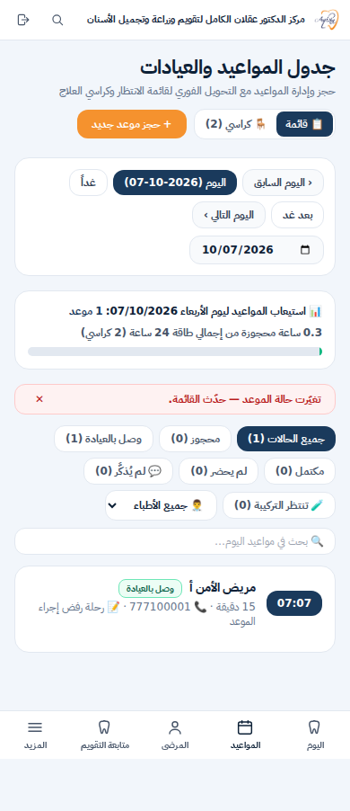
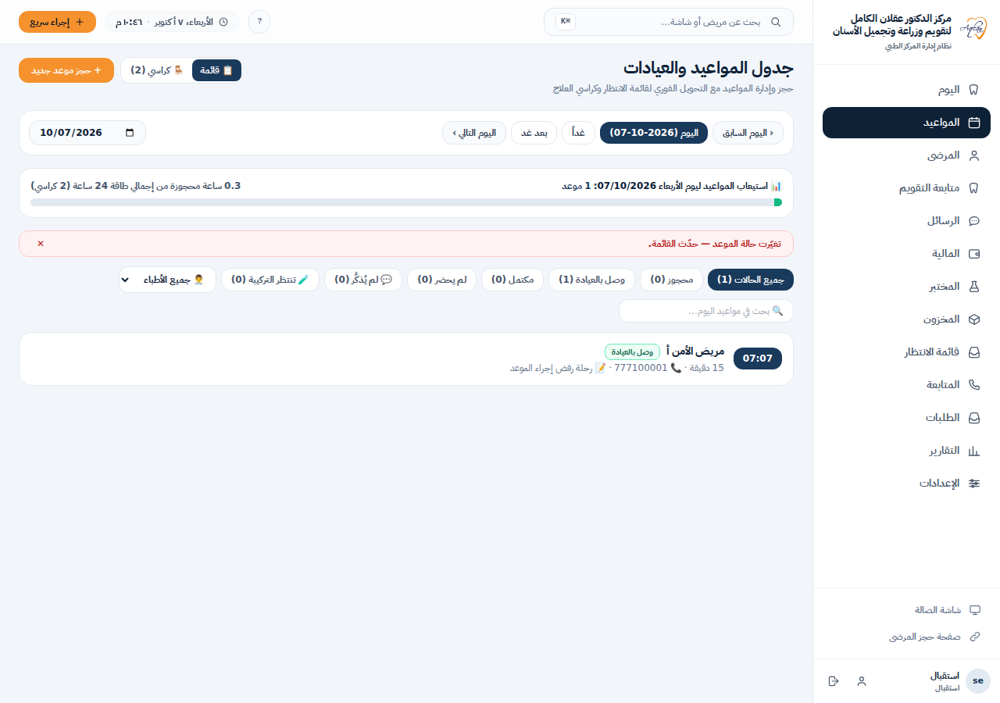
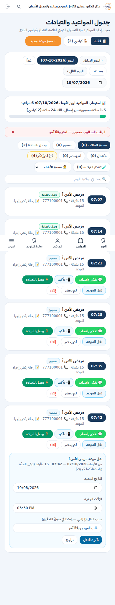
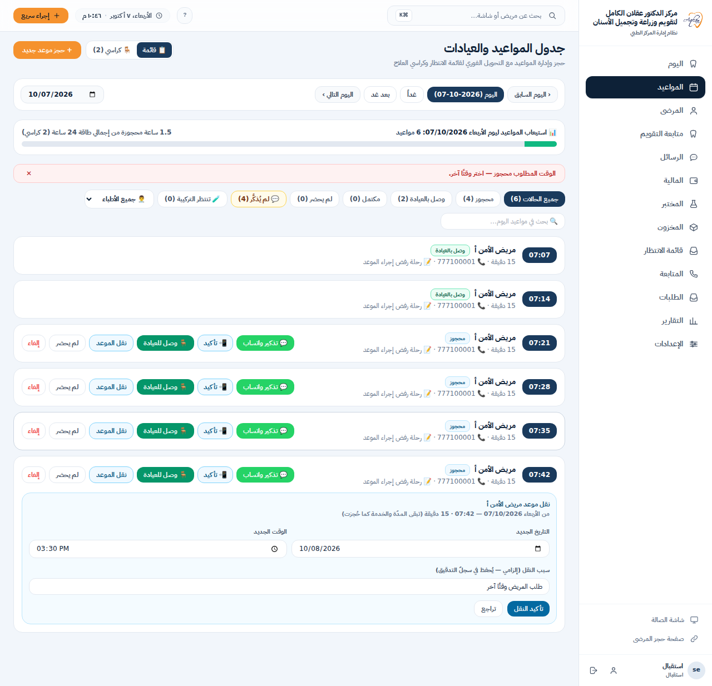
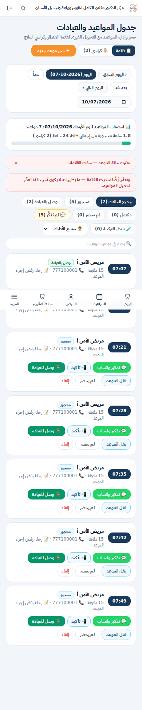
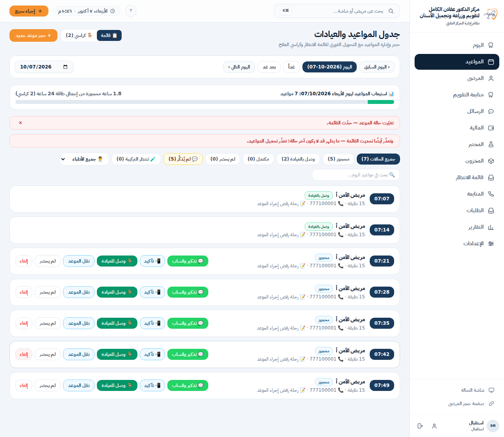

# أدلة: سبب رفض إجراء الموعد يختفي من شاشة المواعيد

النطاق: `app/appointments/page.tsx` واختبار المتصفح
`__tests__/security-http/appointment-action-error-ui-journey.test.ts`.
لم يتغيّر شيء في API ولا في قواعد الحجز والوصول والإلغاء.

## السبب (مُثبَت بالاختبار لا بالقراءة وحدها)

كانت `act()` تكتب سبب الرفض في `error`، وهي الحالة نفسها التي يستعملها تحميل القائمة،
ثم تستدعي `load()`. ونجاح `GET /api/appointments` ينفّذ `setError(null)`، فيُمحى سبب
الرفض فور ظهوره. مثال ذلك: «تغيّرت حالة الموعد — حدّث القائمة.» عند إلغاء موعدٍ سجّل
جهازٌ آخر وصوله. يظنّ الموظّف حينها أنّ الإجراء تمّ.

وظهر عطلان ملاصقان في الدالّة نفسها، وأثبتهما الاختبار أيضًا:

- **ردّ قديم يعيد اليوم السابق.** تبدّل اليوم أثناء طلب الإجراء، فتعيد `act()`
  تحميل اليوم القديم (من الـclosure). ويصير ذلك الطلبُ الأحدث، فيكتب مواعيد الأمس
  تحت تاريخ الغد.
- **نجاح قديم يسحب الشاشة.** نقلٌ ناجح وصل ردّه بعد أن انتقل المستخدم إلى يومٍ آخر،
  فسحب الشاشة إلى يوم الهدف.

## الإصلاح

| الحالة | قبل | بعد |
|---|---|---|
| 409 أو 500 ثم نجح GET | تختفي الرسالة | تبقى في `role="alert"` (`data-action-error`) |
| فشل الإجراء ثم فشل GET | تحلّ رسالة التحميل محلّ سبب الرفض | تنبيهان، والثاني يقول إنّ القائمة قد لا تكون آخر حالة |
| ردّ 2xx غير صالح (ليس JSON) | يُعامَل نجاحًا | «لم يتأكّد تنفيذ الإجراء»، ولا تُنفَّذ آثار النجاح |
| انقطاع الشبكة | رسالة عربية | الرسالة نفسها، وتصرّح بأنّ التنفيذ لم يتأكّد، ولا إعادة إرسال تلقائية |
| رفض النقل | تختفي الرسالة | تبقى الرسالة، وتبقى اللوحة مفتوحة بالتاريخ والوقت والسبب |
| نجاح لاحق | — | يمحو رسالة المحاولة السابقة، ويمكن إخفاؤها يدويًّا بـ✕ |
| تبديل اليوم أثناء الطلب | يُحمَّل اليوم القديم أو تُسحب الشاشة | يُحدَّث اليوم المعروض، ولا تُفتح لوحة الوصول ولا ترشيحات الانتظار لسياقٍ تُرك |
| ضغط متكرّر | الحارس `inFlight` موجود | بقي كما هو، والاختبار يثبت أنّ طلبًا واحدًا فقط يُرسل |

بقي إصلاح TD-REG-026 (النقل بين يومين) كما هو، ونجح اختبار
`appointment-reschedule-ui-journey` بلا تعديل.

## الدليل: الاختبار نفسه قبل الإصلاح وبعده

الـcommit `5e777bb` يضيف الاختبار وحده فوق `main` (`b1d2996`). وعلى بناء تلك النسخة
فشلت 10 حالات من 11، كلٌّ في السطر المقصود:

- اختفاء الرسالة: `expected +0 to be 1` و`expected false to be true`.
- ظهور قائمة اليوم القديم: صفّ الغد غير ظاهر.
- سحب الشاشة: `expected '2026-10-09' to be '2026-10-08'`.

أمّا حالة انقطاع الشبكة فكانت تنجح قبل الإصلاح، لأنّ ذلك المسار لم يكن يعيد التحميل.

وبعد الإصلاح (`21dba75`) نجحت الحالات الـ11 كلّها. ونجحت معها رحلات المواعيد الأخرى:
`reschedule` و`filters` و`availability`، أي 18 من 18.

## لقطات من الاختبار (RTL، العرضان 390 و1280)

| الحالة | 390 | 1280 |
|---|---|---|
| رفض إلغاء حقيقي 409 |  |  |
| رفض النقل، واللوحة باقية بمدخلاتها |  |  |
| رفض الإجراء وفشل التحديث معًا |  |  |

في كلّ لقطة يتحقّق الاختبار من ثلاثة أمور: `dir="rtl"`، وغياب التمرير الأفقي، ووقوع
التنبيه كاملًا داخل عرض الشاشة.

> في اللقطات كاملة الصفحة يظهر شريط التنقّل السفلي الثابت في منتصف الصورة على عرض
> 390. هذا من طريقة التقاط الصفحة الكاملة، لا من تخطيط الشاشة.

كلّ البيانات اصطناعية: مرضى الاختبار المبذورون في قاعدة PostgreSQL 18 معزولة.

## استكمال المراجعة: عقد النجاح وسياق اليوم

وجدت مراجعة المصدر ثغرتين ضيّقتين في الحماية الجديدة:

- كان جسم JSON قابل للتحليل مثل `false` أو `{}` أو `{"ok":false}` يمرّ كنجاح.
  الآن لا ينجح PATCH إلا بكائن غير مصفوفة يؤكّد `ok: true`. حُفظ عقد DELETE
  المختلف بفاحص صريح لرسالة النجاح، دون تعديل API.
- كانت مقارنة تاريخ اليوم وحدها تعيد ملكيّة الرد القديم إذا خرج الموظّف إلى يوم
  آخر ثم عاد. الآن يحمل كل تغيير يوم رقم مراجعة، ولا ينقل الرد القديم الشاشة بعد العودة.

أُضيفت 11 حالة متصفح إلى ملف الرحلة نفسه: سبعة أجسام JSON غير مؤكِّدة للنجاح،
وآثار الوصول والإلغاء عند `ok:false`، والخروج والعودة أثناء نقل متأخر، وضابط
نجاح حذف المدير بعقد الرسالة الحقيقي على البيانات الاصطناعية. الحالات الأصلية
الإحدى عشرة واختبار النقل المنفصل باقية دون تعديل.

هذه الإضافة أُعدّت بمراجعة المصدر فقط؛ نتائج CI المذكورة أعلاه واللقطات الملتزمة
تخصّ `4680184` قبل هذا الاستكمال. لا تُعدّ الحالات الجديدة ناجحة حتى تُنفَّذ في CI
على الـcommit الذي يتضمّنها.

