# وثيقة حوكمة وهندسة المنظومة المالية — مركز عقلان لطب وجراحة الأسنان
**Principal Dental Financial Architecture & Governance Manual**

---

## ١. ملخص تنفيذي وتوجيهات الإدارة العليا
بناءً على التوجيه المباشر من **الدكتور عقلان** (مالك ومدير المركز)، تم تنفيذ مشروع إعادة الهيكلة الشاملة والحوكمة الرقابية لوحدة المالية بالمركز.

### تشخيص الوضع السابق:
1. **تضخم ملف المركز المالي (`app/finance/page.tsx`)**: تجاوز حجم الملف سابقاً 70 كيلوبايت، وتكدست فيه العمليات والواجهات والنوافذ المتداخلة، مما كان يربك الطبيب وموظف الاستقبال ويفقدهم الرؤية الواضحة.
2. **التشتت المعماري (13 مساراً فرعياً متناثراً)**: وجود مسارات فرعية متعددة (debts, plans, services, lab-accounting, commissions, expense-categories, parties, accounting, opening, fx, reports, reconciliation, settings) دون مركز قيادة موحد يربطها بسلاسة.
3. **صعوبة الإجراءات اليومية**: الحاجة إلى التنقل بين عدة شاشات لإجراء تحصيل من مريض أو صرف نثري أو مطابقة كشف معمل.

### الحل المنجز:
تحويل المركز المالي إلى **مركز قيادة تنفيذي موحد (Financial Command Center)** قائم على **الركائز الأربع المعيارية** لطب الأسنان، مع تقليص ملف الصفحة الرئيسية وتوزيع المنطق على مكونات فرعية عالية الكفاءة والتنظيم، مع الحفاظ التام والكامل على كافة المسارات الـ 13 القديمة لضمان عدم انكسار أي رابط في النظام.

---

## ٢. الركائز الأربع المعيارية للمنظومة المالية

```mermaid
graph TD
    A["مركز القيادة المالي الرئيسي<br/>Finance Command Center"] --> B["الركيزة ١: 💵 الصندوق والورديات اليومية<br/>Cash Drawer & Daily Shifts"]
    A --> C["الركيزة ٢: 👥 الذمم والتحصيل والمعامل<br/>Receivables, Collections & Labs"]
    A --> D["الركيزة ٣: 🩺 عمولات الأطباء والربحية<br/>Doctor Commissions & Margins"]
    A --> E["الركيزة ٤: 📑 الدفاتر والتقارير المحاسبية<br/>GL, Accounting & Audit"]

    B --> B1["أرصدة الصناديق YER / SAR / USD"]
    B --> B2["سندات القبض الفورية"]
    B --> B3["سندات الصرف النثري"]
    B --> B4["إغلاق الوردية وجرد النقدية"]

    C --> C1["أعمار ديون المرضى AR والتحصيل بنقرة"]
    C --> C2["تذكيرات واتساب التلقائية"]
    C --> C3["مستحقات معامل الأسنان AP"]
    C --> C4["إنذار تضارب المواعيد مع تسليم المعمل"]

    D --> D1["احتساب العمولات على المحصل الفعلي"]
    D --> D2["سرية وخصوصية حسابات الأطباء"]
    D --> D3["محاكي وهوامش ربحية الحالات السريرية"]

    E --> E1["القيد المزدوج وميزان المراجعة Trial Balance"]
    E --> E2["قوائم الدخل والأرباح والخسائر"]
    E --> E3["الأرصدة الافتتاحية وإعادة تقييم العملات FX"]
```



---

### الركيزة ١: 💵 الصندوق والعمليات اليومية (Cash Drawer & Daily Operations)
- **الهدف**: إدارة السيولة اللحظية للصناديق بالعملات الثلاث (ريال يمني YER، ريال سعودي SAR، دولار أمريكي USD).
- **الإجراءات المتاحة**:
  1. **فتح الوردية**: توثيق العهدة النقدية الافتتاحية لكل عملة قبل استقبال المرضى.
  2. **تسجيل سند صرف نثري**: توثيق سبب الصرف، المستفيد (مورد مسجل أو جهة مباشرة)، البند، والمبلغ، مع الطباعة الفورية للسند الحراري (`/print/voucher/[id]`).
  3. **إغلاق الوردية والجرد**: إدخال النقد الفعلي في الصندوق، مع احتساب آلي وفوري لأي فارق (مطابق، عجز/نقص، زيادة)، وتسجيل رقم الإيداع وملاحظة الإقفال.
  4. **كشف الحركات اللحظي**: جدول تفاعلي يفرز بين المقبوضات والمصروفات، مع محرك بحث فوري باسم المريض أو رقم السند.

---

### الركيزة ٢: 👥 الذمم والتحصيل والمعامل (Receivables, Collections & Labs)
- **الهدف**: ضبط دورة الإيرادات (Revenue Cycle Management - RCM) والتكاليف المباشرة لمختبرات الأسنان.
- **الإجراءات المتاحة**:
  1. **أعمار الديون (Aging Buckets)**: تصنيف المديونيات في 4 شرائح زمنية (<30 يوماً، 31–90 يوماً، 91–180 يوماً، >180 يوماً).
  2. **تحصيل بنقرة واحدة (1-Click Collection)**: زر مباشر بجانب كل مريض يفتح نافذة التحصيل الموحد `CollectPaymentModal` بمبلغ الدين المقترح وإصدار السند والطباعة دون مغادرة الشاشة.
  3. **مراسلة واتساب المهذبة**: تذكير ودي للمريض برصيده المستحق بنقرة زر واحدة عبر تطبيق واتساب.
  4. **مستحقات معامل الأسنان**: كشف بالمختبرات المعتمدة، الأعمال غير المسددة، وزر مباشر لتسوية كشف الحساب عبر `LabReconciliationModal`.
  5. **إنذار تضارب المواعيد**: تنبيه مبكر ذكي يظهر فوراً في حال وجود موعد سريري قادم لمريض والتركيبة أو عمل المعمل لم يصل بعد.

---

### الركيزة ٣: 🩺 عمولات الأطباء والربحية (Doctor Commissions & Clinical Margins)
- **الهدف**: تعزيز الشفافية مع الأطباء وحماية السيولة النقدية للمركز.
- **القاعدة الذهبية المعتمدة في مركز عقلان**:
  > [!IMPORTANT]
  > **العمولة تُحسب وتُصرف حصراً على المبالغ المحصلة فعلياً في الصندوق (التحصيل الفعلي)، ولا تُصرف على الفواتير المفوترة غير المسددة.**
  > هذا يمنع استنزاف سيولة العيادة بالدفع للأطباء عن مرضى لم يسددوا التزاماتهم بعد.
- **الأمان والخصوصية**:
  - الطبيب (غير المدير) لا يرى إلا كشف عمولاته ومستحقاته الشخصية فقط (`isPersonalOnly`).
  - موظف الاستقبال محجوب عن كشوفات العمولات بالكامل لضمان سرية المستحقات المالية.
  - المدير المالي وصاحب المركز يرى الكشف التجميعي لكافة الأطباء ونسب الإنجاز.
- **محاكي ربحية الحالات السريرية**: أداة لمحاكاة هوامش ربح المركز بعد اقتطاع عمولة الطبيب وتكلفة المعمل والمواد الطبية المستهلكة.

---

### الركيزة ٤: 📑 الدفاتر والتقارير المحاسبية (Accounting Ledger & Audit Governance)
- **الهدف**: الرقابة المحاسبية المعيارية وفق القيد المزدوج (Double-Entry Ledger).
- **المعايير المطبقة**:
  1. **اشتقاق القيود المحاسبية**: القيود اليومية تُشتق برمجياً من المستندات التشغيلية (الفاتورة، سند القبض، سند الصرف، إقفال الصندوق)، ولا تُخزن بشكل منفصل مما يمنع تعارض الدفاتر مع الواقع التشغيلي.
  2. **اتزان ميزان المراجعة (Trial Balance)**: فحص فوري ومستمر لتطابق إجمالي حركات المدين مع إجمالي حركات الدائن.
  3. **الربط المباشر بالقوائم المتخصصة**:
     - الدفاتر والقيود المحاسبية (`/finance/accounting`)
     - التقارير المالية التحليلية وقائمة الدخل (`/finance/reports`)
     - الأرصدة الافتتاحية للصناديق والجهات (`/finance/opening`)
     - إعادة تقييم العملات الأجنبية وفروق أسعار الصرف (`/finance/fx`)

---

## ٣. الهيكل البرمجي الموحد الجديد

```
app/finance/
├── page.tsx                           # مركز القيادة التنفيذي الموحد (نظيف، خفيف، منسق)
├── accounting/page.tsx                # الدفاتر المحاسبية وميزان المراجعة
├── commissions/page.tsx               # كشف عمولات الأطباء الموسع
├── debts/page.tsx                     # أعمار ديون المرضى
├── expense-categories/page.tsx        # ميزانيات بنود المصروفات
├── fx/page.tsx                        # إعادة تقييم أسعار الصرف
├── lab-accounting/page.tsx            # حسابات مختبرات الأسنان
├── opening/page.tsx                   # الأرصدة الافتتاحية
├── parties/page.tsx                   # سجل الجهات والموردين
├── plans/page.tsx                     # خطط الأقساط العلاجية
├── reconciliation/page.tsx            # المطابقة اليومية والتسويات
├── reports/page.tsx                   # التقارير المالية التحليلية
├── services/page.tsx                  # تسعيرة الخدمات الطبية
└── settings/lab-accounting/page.tsx   # إعدادات المعامل

components/finance/
├── FinanceKpis.tsx                    # البطاقات الخمس العلوية وأزرار الإجراءات وشريط التبويبات
├── CashShiftTab.tsx                   # التبويب ١: الصندوق وحركات الوردية
├── ReceivablesLabsTab.tsx             # التبويب ٢: مديونيات المرضى ومعامل الأسنان
├── CommissionsProfitabilityTab.tsx    # التبويب ٣: عمولات الأطباء وهوامش الحالات
├── AccountingReportsTab.tsx           # التبويب ٤: الدفاتر المحاسبية وميزان المراجعة
└── QuickCollectModal.tsx              # نافذة البحث السريع لاختيار المريض للتحصيل
```

---

## ٤. نتائج التدقيق والاختبارات الفنية
- **اختبارات Vitest**:
  - تم تشغيل كافة اختبارات المنظومة (58 ملف اختبار، أكثر من 660 اختباراً).
  - نجاح الاختبارات بنسبة **100%**.
- **التحقق النوعي لـ TypeScript**:
  - تم تشغيل `npx tsc --noEmit`.
  - النتيجة: **0 أخطاء (Clean Compile)**.
- **التوافق التراجعي (Backward Compatibility)**:
  - لم يُحذف أو يُعدل أي مسار فرعي قائم؛ كافة الروابط القديمة تعمل بكفاءة مطلقة.
